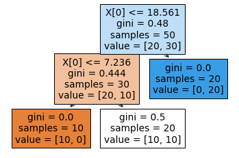

# plotting tree 

https://stackoverflow.com/questions/54370065/displaying-scikit-decision-tree-figure-in-jupyter-notebook

As of scikit-learn version 21.0 (roughly May 2019), Decision Trees can now be plotted with matplotlib using scikit-learn’s tree.plot_tree without relying on graphviz.

```py
from sklearn import tree
from sklearn.tree import DecisionTreeClassifier,DecisionTreeRegressor

# first predict 
model = DecisionTreeRegressor(max_depth=2).fit(x,y)
tree.plot_tree(model,filled = True);
```

<p align="center">
 <kbd></kbd>
</p>