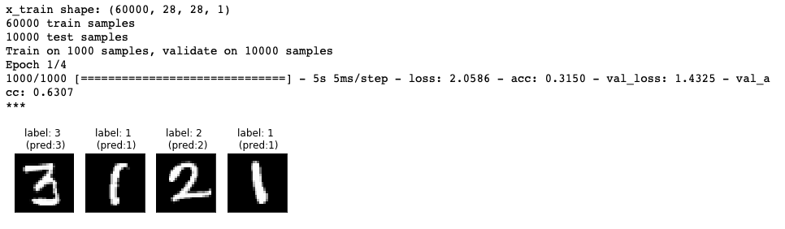

# plot images in grid

- https://stackoverflow.com/questions/25239933/how-to-add-title-to-subplots-in-matplotlib
- https://stackoverflow.com/questions/6541123/improve-subplot-size-spacing-with-many-subplots-in-matplotlib


```py 
# get data 
from keras.datasets import mnist
(x_train, y_train), (x_test, y_test) = mnist.load_data()
```

3 by 3 

```py 
import matplotlib.pyplot as plt

fig, ax = plt.subplots(nrows=3, ncols=3)
plt.subplots_adjust(wspace = 0,hspace = 0.8)

for row in ax:
    for col in row:
        sample_id = np.random.randint(x_train.shape[0], size=1)[0]
        col.axes.get_xaxis().set_visible(False)
        col.axes.get_yaxis().set_visible(False)
        col.imshow(array_to_img(x_train[sample_id]))
        col.title.set_text('label: %s \n (id:%s)' % (np.argmax(y_train[sample_id]),sample_id))

plt.show()
```


single row, multiple columns 

```py 
import matplotlib.pyplot as plt
fig, ax = plt.subplots(nrows=1, ncols=4)

for col in ax:
    sample_id = np.random.randint(x_train.shape[0], size=1)[0]
    col.axes.get_xaxis().set_visible(False)
    col.axes.get_yaxis().set_visible(False)
    col.imshow(array_to_img(x_train[sample_id]))
    col.title.set_text('label: %s \n (id:%s)' % (np.argmax(y_train[sample_id]),sample_id))
plt.show()
```


Application: Keras Lambda Call Back 




