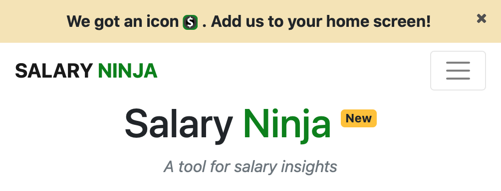

# top notification bar

Example 



Code 

```html 
<body>
    <div style="z-index:5000;background-color:#f4e3b2;border:none;box-shadow:none;box-shadow:none;padding:10px 0 10px 0">
        <center>
                <strong>
                Your notification msg.  
               </strong>
        </center>
        <div class="text-right">
            <a style="cursor:pointer" onclick="this.parentNode.parentNode.remove()">
                <p style="color:#505050;font-size:14px;margin-top:-26px;margin-bottom:5px;margin-right:15px"><i class="fa fa-times"></i></p>
            </a>
        </div>
    </div>

  <nav class>
  ...
</body>
```

