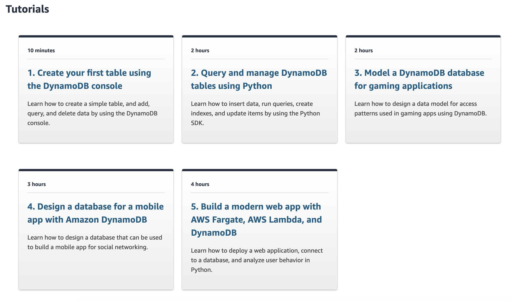

# DynamoDB 

- https://aws.amazon.com/dynamodb/
- https://aws.amazon.com/dynamodb/getting-started/

## basic CLI 

```sh 
aws dynamodb list-tables
aws dynamodb scan --table-name <TABLE_NAME> --select "COUNT"
```

## Tutorial 





1. [Create and Query a NoSQL Table](https://aws.amazon.com/getting-started/tutorials/create-nosql-table/)

- The `partition key` is used to spread data across partitions for scalability. It’s important to choose an attribute with a wide range of values and that is likely to have evenly distributed access patterns.


2. [Create and Manage a Nonrelational Database](https://aws.amazon.com/getting-started/projects/create-manage-nonrelational-database-dynamodb/)

```sh 
curl -sL https://s3.amazonaws.com/ddb-deep-dive/dynamodb.tar | tar -xv
sudo pip install boto3
python create_table.py
python insert_items.py
python get_item.py
python query_items.py
python add_secondary_index.py
python query_with_index.py
python update_item.py
python delete_table.py
history > history.txt
```

3. [Model a DynamoDB database for gaming applications](https://aws.amazon.com/getting-started/projects/data-modeling-gaming-app-with-dynamodb/)

4. [Design a database for a mobile app with Amazon DynamoDB](https://aws.amazon.com/getting-started/projects/design-a-database-for-a-mobile-app-with-dynamodb/)

Notes 

- Focus on access patterns: Before designing your DynamoDB table, document every need you have for reading and writing data in your application.
- Optimize for number of requests to DynamoDB
- Don’t fake a relational model
  - DynamoDB does not allow for joins because they slow down as your table grows.
  - Too many secondary indexes
- Steps  
 - Step 1: Build your entity-relationship diagram
 - Step 2: Consider <entity> access patterns
- the partition key is called HASH and the sort key is called RANGE,
- The Resource object is useful in this situation because it batches our requests.
- inverted index (part of secondary index)
 - allow you to reshape your data to allow for alternate query patterns.
 - Scans are discouraged in DynamoDB except in specific circumstances because they access every item in your database.
- Partial normalization
 - One core tenant of relational model is normalization of data in which you avoid duplicating data in multiple places.
- DynamoDB Transactions
 - ACID
 - Transactions are popular in relational systems for operations that affect multiple data elements at once.
 - useful when your write actions requires checking and then writing. making sure certain actions were not already performed. 
- key 
 - A single-table design that combined multiple entity types in one table.
 - A composite primary key that allow for many-to-many relationships.
 - An inverted index to allow reverse lookups on our many-to-many entity.
 - Partial normalization to keep our data fresh while remaining performant.
 - DynamoDB transactions to handle complex write patterns across multiple items.

history 

```sh 
python scripts/create_table.py
python scripts/bulk_load_table.py
aws dynamodb scan \
 --table-name quick-photos \
 --select COUNT
python application/fetch_user_and_photos.py
python scripts/add_inverted_index.py
python application/fetch_photo_and_reactions.py
python application/find_following_for_user.py
python application/find_and_enrich_following_for_user.py
python application/add_reaction.py
python application/follow_user.py
python scripts/delete_table.py
```
