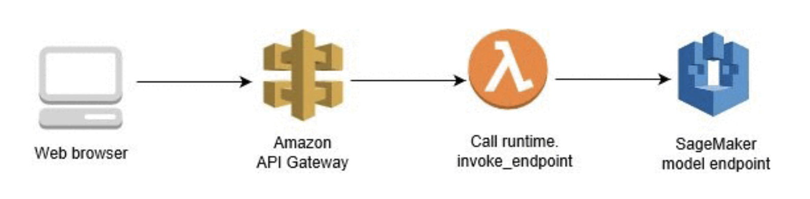

# Calling SageMaker Endpoint using API Gateway 

https://aws.amazon.com/blogs/machine-learning/call-an-amazon-sagemaker-model-endpoint-using-amazon-api-gateway-and-aws-lambda/




Create a Lambda function that calls the SageMaker Runtime Invoke_Endpoint


```py 
import os
import io
import boto3
import json
import csv

# grab environment variables
ENDPOINT_NAME = os.environ['ENDPOINT_NAME']
runtime= boto3.client('runtime.sagemaker')

def lambda_handler(event, context):
    print("Received event: " + json.dumps(event, indent=2))
    
    data = json.loads(json.dumps(event))
    payload = data['data']
    print(payload)
    
    response = runtime.invoke_endpoint(EndpointName=ENDPOINT_NAME,
                                       ContentType='text/csv',
                                       Body=payload)
    print(response)
    result = json.loads(response['Body'].read().decode())
    print(result)
    pred = int(result['predictions'][0]['predicted_label'])
    predicted_label = 'M' if pred == 1 else 'B'
    
    return predicted_label
```