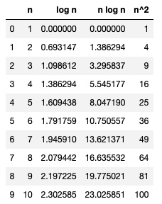

# time and space complexity 

References: 
 
- https://levelup.gitconnected.com/time-and-space-complexity-725dcba31902
- https://en.wikipedia.org/wiki/Time_complexity
- https://en.wikipedia.org/wiki/Space_complexity


### Plots 





## Time Complexity 

- aka How long it takes to run the program. 
- the time complexity is the computational complexity that describes the amount of time it takes to run an algorithm. 


## Space Complexity 

- aka How much memory it takes to run the program. 
- It is the memory required by an algorithm to execute a program. 


## Big O Notation

- Used to describe time and space complexity. 


## Examples 


### What does O(log n) time complexity mean exactly? 


- [img source](https://dev.to/b0nbon1/understanding-big-o-notation-with-javascript-25mc)
- https://stackoverflow.com/questions/2307283/what-does-olog-n-mean-exactly

```
O(log N) basically means time goes up linearly while the n goes up exponentially. So if it takes 1 second to compute 10 elements, it will take 2 seconds to compute 100 elements, 3 seconds to compute 1000 elements, and so on.
```

```
The most common attributes of logarithmic running-time function are that:

1. the choice of the next element on which to perform some action is one of several possibilities, and only one will need to be chosen. or 
2. the elements on which the action is performed are digits of n

For example, looking up people in a phone book is O(log n). You don't need to check every person in the phone book to find the right one; instead, you can simply divide-and-conquer by looking based on where their name is alphabetically, and in every section you only need to explore a subset of each section before you eventually find someone's phone number.
```

### O(N Log N)


