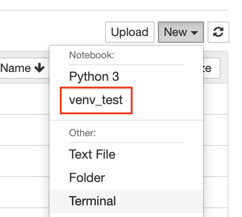

# Add Virtual Environment to Jupyter Notebook

- https://janakiev.com/til/jupyter-virtual-envs/
- https://anbasile.github.io/programming/2017/06/25/jupyter-venv/
- https://medium.com/@eleroy/jupyter-notebook-in-a-virtual-environment-virtualenv-8f3c3448247 -> simpler 

### Setup venv

```
virtualenv venv_test
source venv_tf2.0/bin/activate
# install necessary packages here 
ipython kernel install --user --name=venv_test
jupyter notebook 
deactivate 
# then select your environment as shown below
```

<center>

</center>

### Remove venv

```
# view jupyter notebook environments 
jupyter kernelspec list

# remove 
jupyter kernelspec uninstall venv_test
```
