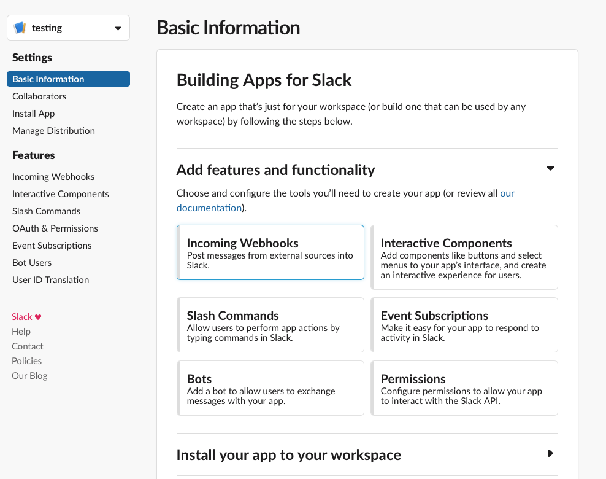
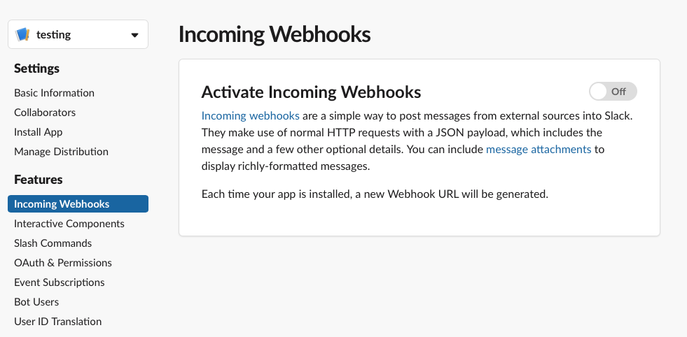
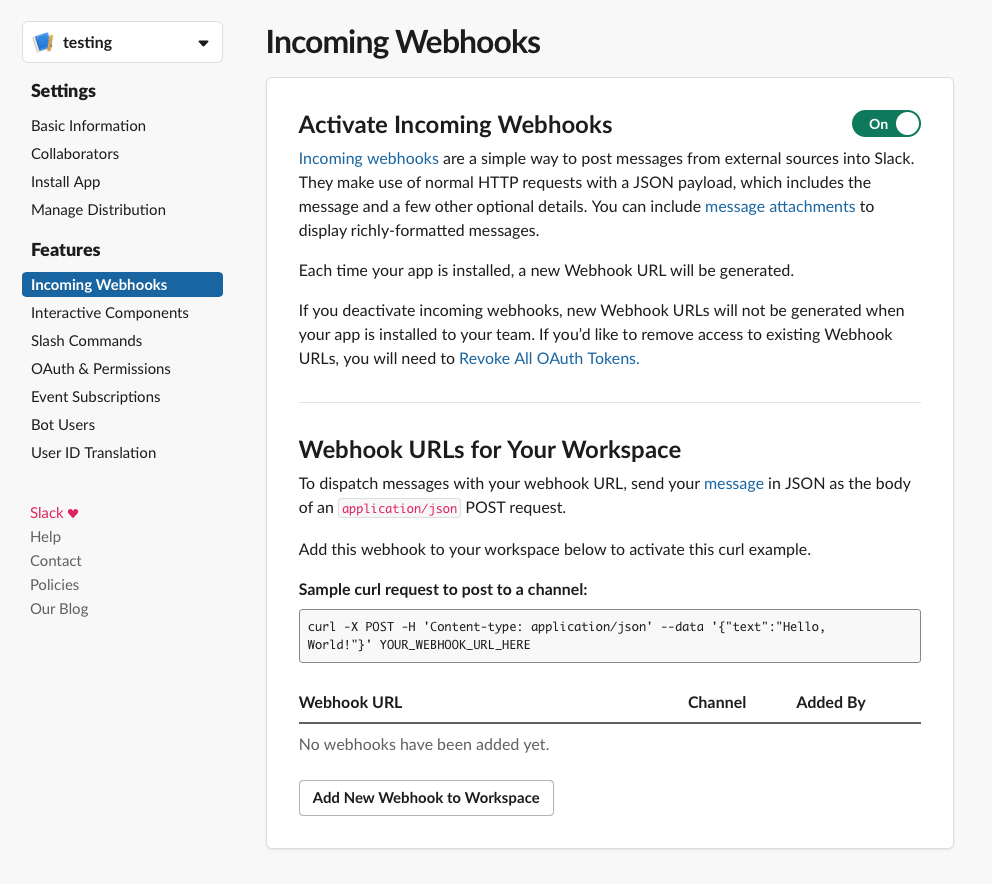
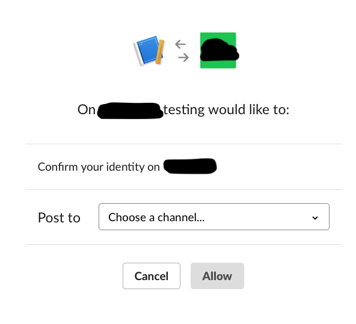
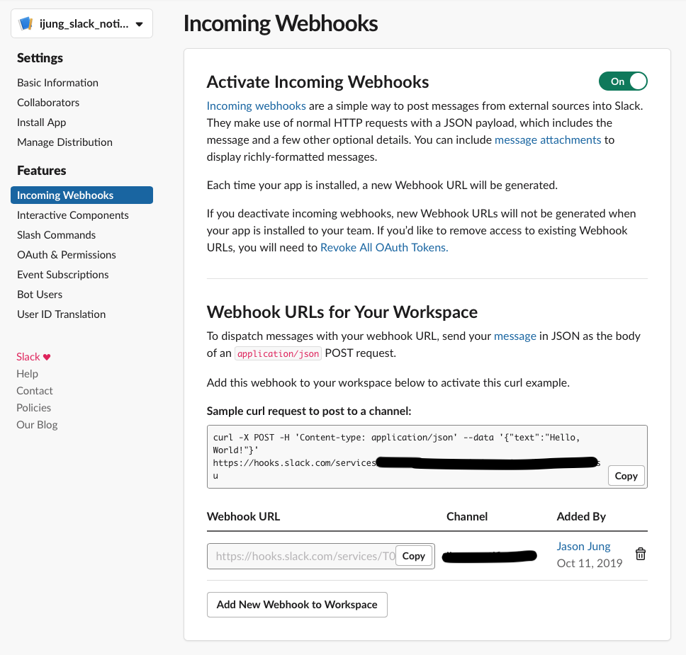

# Sending Slack App Notification

Date: 2019-10 

Goal: Build your own slack app so that it sends you notification when your process finishes running, e.g. when model finishes training. 

If you are running a process that takes a long time, it is often important to be notified when the process finishes running. There are few ways to acheive this: python email module, text message, etc. This method will let you send slack notification instead. It should only take few minutes to set up even if you have never built one before. Moreover, it only takes one line of code to send you notification instead of dozens in the python email module. I hope this boosts your productivity. 

## Demo 


## Steps 

1. Visit api.slack.com and click `start building`


2. `Create a Slack App`. Choose your app name and workspace. 


3. Add the functionality of `Incoming Webhooks`. This allows you to post message to slack app from anywhere.


4. Turn on the `Webhooks`. 


5. Now, click `Add New Webhook to Workspace`.


6. This is where you choose the channel you want your slack app to send messages. I recommend you creating a new private channel for yourself. 


7. After you add the channel, it will look something like this. Below you can see the command like: 

	```
	curl -X POST -H 'Content-type: application/json' --data '{"text":"Hello, World!"}' YOUR_WEBHOOK_URL_HERE"
	```
This is the command you can run from anywhere like your terminal and it will send you a slack notification! Check the demo video of how I use this. 


8. Here is a Python example: 

	```py 
	def slack_done(msg):
		os.system("curl -X POST -H 'Content-type: application/json' --data '{\"text\":\"%s\"}' https://hooks.slack.com/services/<your_token>" % msg)
		print('sent slack notification')
	```